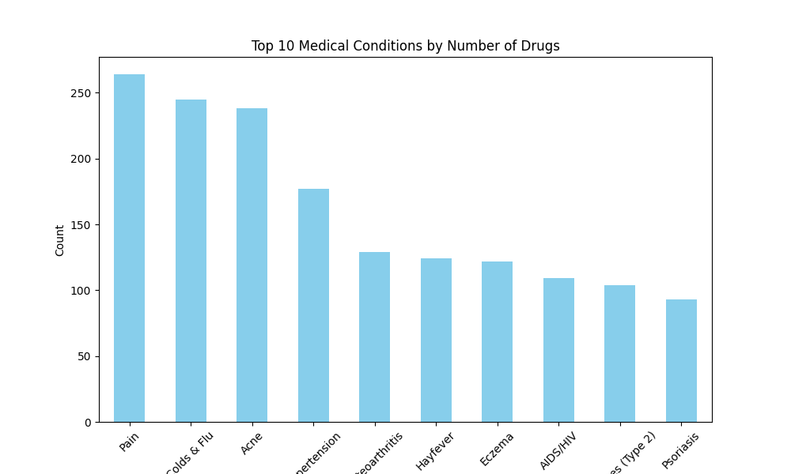

# 💊 Drugs, Side Effects & Medical Conditions Analysis

A data analysis and visualization project exploring the relationships between **drugs**, their **side effects**, **medical conditions**, and **user ratings**.
Includes a **Python backend** for data cleaning/analysis and a **Streamlit frontend dashboard** for interactive exploration.

---

## 📌 Features

* 🔎 Clean and preprocess real drug dataset
* 📊 Exploratory Data Analysis (EDA) with **charts & stats**
* 📂 Generate CSV summaries (conditions, side effects, drug classes)
* 🌐 Interactive **Streamlit dashboard** with filters and visualizations

---

## 📂 Project Structure

```
├── main.py                        # Backend analysis & data cleaning
├── app.py                         # Streamlit frontend dashboard
├── drugs_side_effects_drugs_com.csv   # Original dataset
├── cleaned_drugs_dataset.csv      # Cleaned dataset (generated)
├── medical_condition_counts.csv   # Summary output (generated)
├── side_effect_counts.csv         # Summary output (generated)
├── drug_classes_counts.csv        # Summary output (generated)
├── ratings_distribution.png       # Visualization (generated)
├── top_conditions.png             # Visualization (generated)
├── top_side_effects.png           # Visualization (generated)
├── ratings_by_class.png           # Visualization (generated)
├── correlation_heatmap.png        # Visualization (generated)
└── README.md
```

---

**Features:**

* Filter by **medical condition** and **drug class**
* View **ratings distribution**
* Explore **top conditions** and **side effects**
* Interactive **data table**

---

## 📸 Sample Visualizations

### Drug Ratings Distribution


### Top Medical Conditions



### Most Common Side Effects


---

## 🛠️ Tech Stack

* **Python 3.13**
* [Pandas](https://pandas.pydata.org/) – Data manipulation
* [Numpy](https://numpy.org/) – Numerical processing
* [Matplotlib](https://matplotlib.org/) / [Seaborn](https://seaborn.pydata.org/) – Visualization
* [Scikit-learn](https://scikit-learn.org/) – Data preprocessing
* [Streamlit](https://streamlit.io/) – Web dashboard

---

## 🚀 Future Enhancements

* 🔮 Predict **drug ratings** using ML models
* 💡 Build a **drug recommendation system**
* ☁️ Deploy the dashboard on **Streamlit Cloud / Heroku**

---


